# Execution Plan

## Detailed Analysis Summary

### Change Impact Assessment
- **User-facing changes**: Yes — new web application with admin UI for inventory, clients, and checkout
- **Structural changes**: Yes — entirely new system with Django backend + React frontend
- **Data model changes**: Yes — new database schema (Category, Item, Client, Transaction, TransactionItem)
- **API changes**: Yes — new REST API surface (all endpoints are new)
- **NFR impact**: Yes — security, performance, containerization requirements

### Risk Assessment
- **Risk Level**: Medium (new system, but well-understood tech stack and moderate scope)
- **Rollback Complexity**: Easy (greenfield — no existing system to break)
- **Testing Complexity**: Moderate (multi-layer: API + UI + business logic)

## Workflow Visualization

```mermaid
flowchart TD
    Start(["User Request"])
    
    subgraph INCEPTION["INCEPTION PHASE"]
        WD["Workspace Detection<br/>COMPLETED"]
        RA["Requirements Analysis<br/>COMPLETED"]
        US["User Stories<br/>COMPLETED"]
        WP["Workflow Planning<br/>COMPLETED"]
        AD["Application Design<br/>EXECUTE"]
        UG["Units Generation<br/>EXECUTE"]
    end
    
    subgraph CONSTRUCTION["CONSTRUCTION PHASE"]
        FD["Functional Design<br/>EXECUTE"]
        NFRA["NFR Requirements<br/>EXECUTE"]
        NFRD["NFR Design<br/>EXECUTE"]
        CG["Code Generation<br/>EXECUTE"]
        BT["Build and Test<br/>EXECUTE"]
    end
    
    Start --> WD
    WD --> RA
    RA --> US
    US --> WP
    WP --> AD
    AD --> UG
    UG --> FD
    FD --> NFRA
    NFRA --> NFRD
    NFRD --> CG
    CG --> BT
    BT --> End(["Complete"])

    style WD fill:#4CAF50,stroke:#1B5E20,stroke-width:3px,color:#fff
    style RA fill:#4CAF50,stroke:#1B5E20,stroke-width:3px,color:#fff
    style US fill:#4CAF50,stroke:#1B5E20,stroke-width:3px,color:#fff
    style WP fill:#4CAF50,stroke:#1B5E20,stroke-width:3px,color:#fff
    style AD fill:#FFA726,stroke:#E65100,stroke-width:3px,stroke-dasharray: 5 5,color:#000
    style UG fill:#FFA726,stroke:#E65100,stroke-width:3px,stroke-dasharray: 5 5,color:#000
    style FD fill:#FFA726,stroke:#E65100,stroke-width:3px,stroke-dasharray: 5 5,color:#000
    style NFRA fill:#FFA726,stroke:#E65100,stroke-width:3px,stroke-dasharray: 5 5,color:#000
    style NFRD fill:#FFA726,stroke:#E65100,stroke-width:3px,stroke-dasharray: 5 5,color:#000
    style CG fill:#4CAF50,stroke:#1B5E20,stroke-width:3px,color:#fff
    style BT fill:#4CAF50,stroke:#1B5E20,stroke-width:3px,color:#fff
    style Start fill:#CE93D8,stroke:#6A1B9A,stroke-width:3px,color:#000
    style End fill:#CE93D8,stroke:#6A1B9A,stroke-width:3px,color:#000
    style INCEPTION fill:#BBDEFB,stroke:#1565C0,stroke-width:3px,color:#000
    style CONSTRUCTION fill:#C8E6C9,stroke:#2E7D32,stroke-width:3px,color:#000
    
    linkStyle default stroke:#333,stroke-width:2px
```



### Text Alternative
```
Phase 1: INCEPTION
- Workspace Detection (COMPLETED)
- Requirements Analysis (COMPLETED)
- User Stories (COMPLETED)
- Workflow Planning (COMPLETED)
- Application Design (EXECUTE)
- Units Generation (EXECUTE)

Phase 2: CONSTRUCTION
- Functional Design (EXECUTE, per-unit)
- NFR Requirements (EXECUTE, per-unit)
- NFR Design (EXECUTE, per-unit)
- Infrastructure Design (SKIP)
- Code Generation (EXECUTE, per-unit)
- Build and Test (EXECUTE)
```

## Phases to Execute

### INCEPTION PHASE
- [x] Workspace Detection (COMPLETED)
- [x] Requirements Analysis (COMPLETED)
- [x] User Stories (COMPLETED)
- [x] Workflow Planning (COMPLETED)
- [ ] Application Design - EXECUTE
  - **Rationale**: New system requires component identification, service layer design, and API contract definition between frontend and backend
- [ ] Units Generation - EXECUTE
  - **Rationale**: System has distinct backend and frontend components that benefit from structured decomposition into implementable units

### CONSTRUCTION PHASE
- [ ] Functional Design - EXECUTE (per-unit)
  - **Rationale**: New data models, business rules (balance deduction, stock management, cart logic), and API schemas need detailed design
- [ ] NFR Requirements - EXECUTE (per-unit)
  - **Rationale**: Security requirements (SECURITY extension enabled), performance targets, and containerization need specification
- [ ] NFR Design - EXECUTE (per-unit)
  - **Rationale**: Security patterns (auth, session, input validation, rate limiting) and Docker configuration need design
- [ ] Infrastructure Design - SKIP
  - **Rationale**: Initial deployment is local. Docker setup is straightforward and can be handled in NFR Design and Code Generation. No cloud infrastructure to design yet.
- [ ] Code Generation - EXECUTE (per-unit)
  - **Rationale**: Implementation of all components
- [ ] Build and Test - EXECUTE
  - **Rationale**: Build verification and comprehensive test instructions

### OPERATIONS PHASE
- [ ] Operations - PLACEHOLDER
  - **Rationale**: Future expansion — not applicable for local/Docker deployment

## Stages Skipped

| Stage | Rationale |
|---|---|
| Reverse Engineering | Greenfield project — no existing code |
| Infrastructure Design | Local deployment with Docker; no cloud infrastructure to design |
| Operations | Placeholder for future |

## Estimated Timeline
- **Total Stages to Execute**: 7 remaining (Application Design, Units Generation, then per-unit: Functional Design, NFR Requirements, NFR Design, Code Generation, Build and Test)
- **Estimated Effort**: Moderate — well-scoped system with clear requirements

## Success Criteria
- **Primary Goal**: Working food bank inventory management system with admin checkout workflow
- **Key Deliverables**:
  - Django REST API with full CRUD for inventory, clients, and transactions
  - React TypeScript frontend with checkout workflow
  - Docker configuration for both services
  - SQLite database with migration-ready design
  - Comprehensive test coverage
- **Quality Gates**:
  - All SECURITY rules compliant
  - Property-based tests for pure functions
  - All user story acceptance criteria met
  - API input validation on all endpoints
  - Structured logging configured
